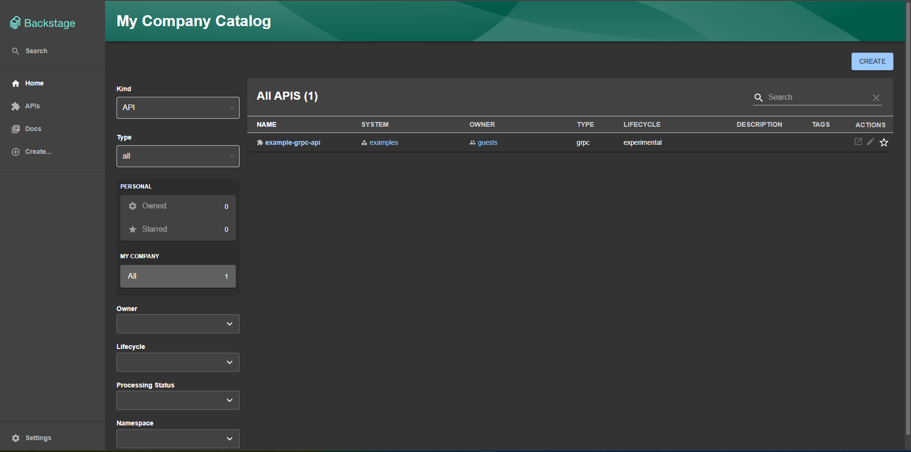
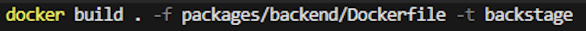
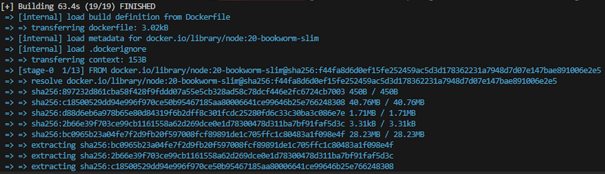
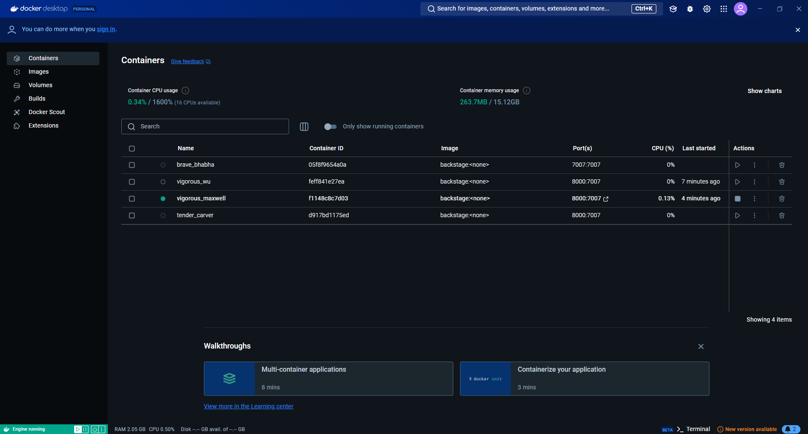
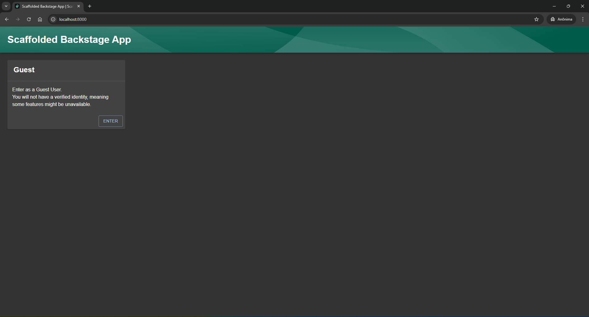

# Documentação de Deploy do Backstage com Docker

## 1. Introdução
Este documento tem como objetivo apresentar o processo completo para compilação, construção e execução do Backstage utilizando Docker. O Backstage é uma plataforma open-source desenvolvida pela Spotify, focada em gerenciamento de serviços e documentação.

O processo detalhado envolve a preparação do ambiente, compilação do projeto localmente (Host Build) e a criação de uma imagem Docker para execução do servidor em um contêiner.


## 2. Pré-requisitos
Antes de iniciar o processo, é necessário que o ambiente esteja configurado com as seguintes ferramentas:

1. **Node.js** (versão 16 ou superior)
   - [Download Node.js](https://nodejs.org)
   - Verificar instalação:
     ```bash
     node -v
     npm -v
     ```

2. **Yarn** (gerenciador de pacotes JavaScript)
   - Instalar Yarn globalmente:
     ```bash
     npm install -g yarn
     ```
   - Verificar instalação:
     ```bash
     yarn -v
     ```

3. **Docker** e **Docker Compose**
   - [Download Docker Desktop](https://www.docker.com/products/docker-desktop)
   - Verificar instalação do Docker:
     ```bash
     docker --version
     docker-compose --version
     ```

4. **Git**
   - [Download Git](https://git-scm.com/)
   - Verificar instalação:
     ```bash
     git --version
     ```

---

## 3. Preparação do Projeto Backstage

### 3.1 Criação do Projeto
Execute os comandos abaixo para criar um projeto Backstage.

```bash
npx @backstage/create-app@latest
```
- Durante a execução, será solicitado um nome para o projeto. Utilize `backstage` ou outro de sua preferência.

### 3.2 Navegar até a Pasta do Projeto
```bash
cd backstage
```

### 3.3 Instalar Dependências
Instale as dependências do projeto utilizando o Yarn:

```bash
yarn install --immutable
```

---

## 4. Compilação e Construção Local

### 4.1 Compilação de Tipos TypeScript
```bash
yarn tsc
```

### 4.2 Construção do Backend
O comando abaixo cria o pacote do servidor backend na pasta `dist`:

```bash
yarn build:backend
```

---

## 5. Construção da Imagem Docker

### 5.1 Preparar o Dockerfile
No diretório `packages/backend`, crie um arquivo `Dockerfile` com o seguinte conteúdo:

```dockerfile
FROM node:20-bookworm-slim

# Instala dependências necessárias
ENV PYTHON=/usr/bin/python3
RUN apt-get update && \
    apt-get install -y --no-install-recommends python3 g++ build-essential libsqlite3-dev && \
    rm -rf /var/lib/apt/lists/*

# Configura o usuário e diretório
USER node
WORKDIR /app

# Copia arquivos essenciais
COPY --chown=node:node .yarn ./.yarn
COPY --chown=node:node .yarnrc.yml ./
COPY --chown=node:node backstage.json ./
COPY --chown=node:node yarn.lock package.json app-config*.yaml ./

# Instala dependências em produção
ENV NODE_ENV=production
RUN yarn workspaces focus --all --production

# Copia o backend compilado
COPY --chown=node:node packages/backend/dist/bundle.tar.gz ./
RUN tar xzf bundle.tar.gz && rm bundle.tar.gz

CMD ["node", "packages/backend", "--config", "app-config.yaml", "--config", "app-config.production.yaml"]
```

### 5.2 Criar o Arquivo `.dockerignore`
No diretório raiz do projeto, crie um arquivo `.dockerignore` com o seguinte conteúdo:

```
.git
.yarn/cache
.yarn/install-state.gz
node_modules
packages/*/src
packages/*/node_modules
plugins
*.local.yaml
```

### 5.3 Construir a Imagem Docker
Execute o comando a partir da raiz do projeto:

```bash
docker build . -f packages/backend/Dockerfile -t backstage
```

**Evidência:** Captura de tela do terminal mostrando o sucesso do build da imagem.

---

## 6. Execução da Imagem Docker

### 6.1 Rodar o Contêiner Docker
Execute o comando para iniciar o servidor backend:

```bash
docker run -it -p 8000:7007 backstage
```

### 6.2 Acessar o Backstage no Navegador
Abra o navegador e acesse o endereço:

```
http://localhost:8000
```




---

## 7. Evidências da Execução

### 7.1 Docker Build Finalizado




### 7.2 Execução do Docker



### 7.3 Tela Inicial do Backstage



### 7.4 Tela do Catálogo de Serviços

